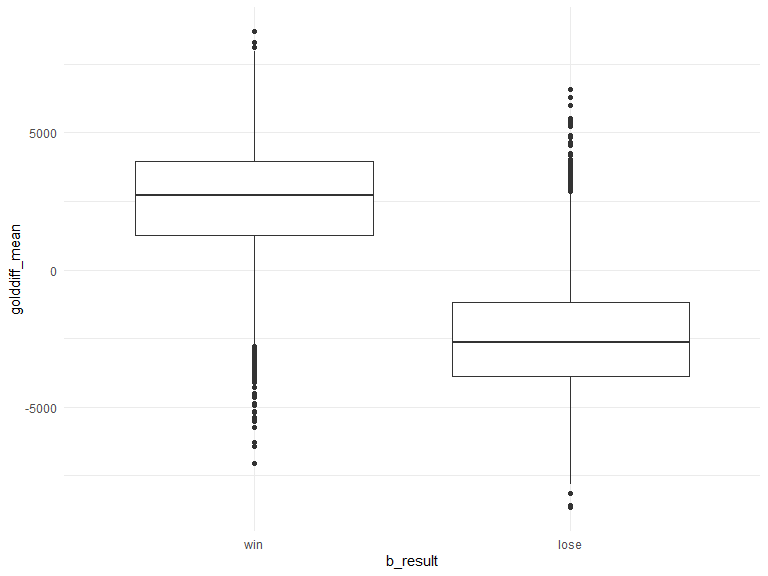

NL\_Gold
================
Nankun
2019/12/2

notice: Gold difference - computed Blue minus Red

``` r
#import#
gold = read_csv(file = "./data/gold.csv")
```

    ## Parsed with column specification:
    ## cols(
    ##   .default = col_double(),
    ##   Address = col_character(),
    ##   Type = col_character(),
    ##   min_69 = col_logical(),
    ##   min_70 = col_logical(),
    ##   min_71 = col_logical(),
    ##   min_72 = col_logical(),
    ##   min_73 = col_logical(),
    ##   min_74 = col_logical(),
    ##   min_75 = col_logical(),
    ##   min_76 = col_logical(),
    ##   min_77 = col_logical(),
    ##   min_78 = col_logical(),
    ##   min_79 = col_logical(),
    ##   min_80 = col_logical(),
    ##   min_81 = col_logical(),
    ##   min_82 = col_logical(),
    ##   min_83 = col_logical(),
    ##   min_84 = col_logical(),
    ##   min_85 = col_logical(),
    ##   min_86 = col_logical()
    ##   # ... with 9 more columns
    ## )

    ## See spec(...) for full column specifications.

``` r
#cleaning#
gold_cl = 
  gold %>% 
  janitor::clean_names() %>% 
  filter(type == "golddiff") %>% 
  mutate(
    address = str_remove(address, "http://matchhistory.na.leagueoflegends.com/en/#match-details/TRLH1/")
  ) %>% 
  pivot_longer(
  min_1:min_95,
  names_to = "min", 
  names_prefix = "min_",
  values_to = "gold") %>% 
  drop_na()

gold_ave =
  gold_cl %>% 
  group_by(address) %>% 
  summarize(
    golddiff_mean = mean(gold)
  )
```

combine

``` r
overall = 
  read_csv(file = "./data/LeagueofLegends.csv") %>% 
  janitor::clean_names() %>% 
  mutate(address = str_remove(address, "http://matchhistory.na.leagueoflegends.com/en/#match-details/TRLH1/")) %>% 
  select(address, b_result)
```

    ## Parsed with column specification:
    ## cols(
    ##   .default = col_character(),
    ##   Year = col_double(),
    ##   bResult = col_double(),
    ##   rResult = col_double(),
    ##   gamelength = col_double()
    ## )

    ## See spec(...) for full column specifications.

``` r
gold_mg = 
  left_join(overall, gold_ave, by = "address") %>% 
  mutate(b_result = recode_factor(b_result, "1" = "win", "0" = "lose"))
```

Plot

``` r
gold_mg %>% 
  ggplot(aes(x = b_result, y = golddiff_mean)) + 
  geom_boxplot()
```



## logistic model

``` r
gold_log = gold_mg %>% 
  glm(formula =  b_result ~ golddiff_mean, family = "binomial")
 
gold_log %>% 
  broom::tidy() %>% 
  knitr::kable(digits = 3)
```

| term           | estimate | std.error | statistic | p.value |
| :------------- | -------: | --------: | --------: | ------: |
| (Intercept)    |  \-0.113 |     0.038 |   \-3.008 |   0.003 |
| golddiff\_mean |  \-0.001 |     0.000 |  \-46.505 |   0.000 |

``` r
gold_log %>% 
  broom::glance() %>% 
  knitr::kable(digits = 3)
```

| null.deviance | df.null |     logLik |      AIC |      BIC | deviance | df.residual |
| ------------: | ------: | ---------: | -------: | -------: | -------: | ----------: |
|      10504.22 |    7619 | \-2319.047 | 4642.094 | 4655.971 | 4638.094 |        7618 |
