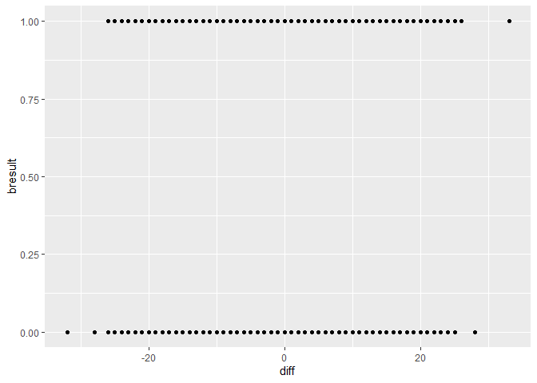
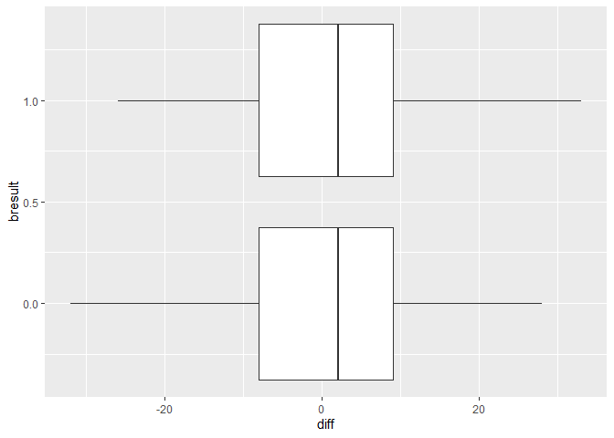
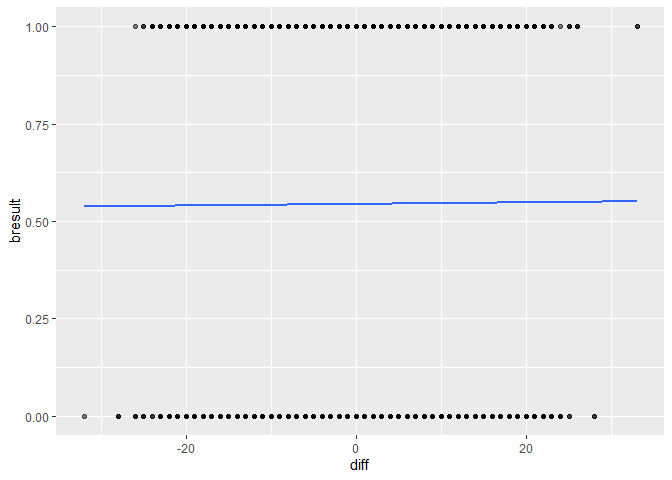

Kills\_difference
================
Ziyi Zhao
11/28/2019

# Difference of number of kills between Blue team and Red Team

Steps: \* import dataset LeaguofLegends.csv and kills.csv. \* use all
data \* extract address as key variable \* merged kills.csv with key \*
calculate difference of number of kills between blue team and red team

``` r
lol <- read_csv("./data/LeagueofLegends.csv")
```

    ## Parsed with column specification:
    ## cols(
    ##   .default = col_character(),
    ##   Year = col_double(),
    ##   bResult = col_double(),
    ##   rResult = col_double(),
    ##   gamelength = col_double()
    ## )

    ## See spec(...) for full column specifications.

``` r
kills <- read_csv("./data/kills.csv")
```

    ## Parsed with column specification:
    ## cols(
    ##   Address = col_character(),
    ##   Team = col_character(),
    ##   Time = col_double(),
    ##   Victim = col_character(),
    ##   Killer = col_character(),
    ##   Assist_1 = col_character(),
    ##   Assist_2 = col_character(),
    ##   Assist_3 = col_character(),
    ##   Assist_4 = col_character(),
    ##   x_pos = col_character(),
    ##   y_pos = col_character()
    ## )

``` r
lol_all <- lol %>% janitor::clean_names()
```

    ## Warning in FUN(X[[i]], ...): strings not representable in native encoding
    ## will be translated to UTF-8

``` r
## set key
key <- pull(lol_all,address) %>% as_tibble()
```

    ## Warning: Calling `as_tibble()` on a vector is discouraged, because the behavior is likely to change in the future. Use `tibble::enframe(name = NULL)` instead.
    ## This warning is displayed once per session.

``` r
## merged the kills.csv with key
colnames(key) <- "address"
kills <- kills %>% janitor::clean_names()
kills_all <- left_join(key, kills, by="address")

## calculate kill difference between blue team and red team
kills_diff <- kills_all %>% 
  group_by(address,team) %>%
  select(address,team) %>% 
  summarize(n=n()) %>% 
  pivot_wider(
    names_from = "team",
    values_from = "n") %>%
  mutate(diff = bKills - rKills)

## extract bResult from dataset
outcome <- pull(lol_all,b_result) %>% as_tibble()
colnames(outcome) <- "bresult"

df <- bind_cols(kills_diff,outcome)
```

# Create plots to see realtionship between blue win and kill difference

``` r
df %>% ggplot(aes(x=diff,y=bresult))+
  geom_point()
```

<!-- -->

``` r
df %>%  ggplot((aes(x=bresult,y=diff,group = bresult)))+
  geom_boxplot()+
  coord_flip()
```

<!-- -->

``` r
df %>% ggplot(aes(x=diff,y=bresult))+
  geom_point(alpha=0.5)+
  stat_smooth(method="glm", se=FALSE, fullrange=TRUE, 
              method.args = list(family=binomial))
```

<!-- -->

# conduct logistics regression analysis about blue win and kill difference

``` r
fit <- glm(bresult ~ diff, df, family = binomial)
fit %>% broom::tidy() %>% 
  mutate(OR = exp(estimate),
         lower_CI = exp(estimate-1.96*std.error),
         higher_CI = exp(estimate+1.96*std.error)) %>%
  select(term,log_OR = estimate,OR,lower_CI,higher_CI,p.value) %>% 
  knitr::kable(digits = 3)
```

| term        | log\_OR |    OR | lower\_CI | higher\_CI | p.value |
| :---------- | ------: | ----: | --------: | ---------: | ------: |
| (Intercept) |   0.176 | 1.193 |     1.140 |      1.248 |   0.000 |
| diff        |   0.001 | 1.001 |     0.996 |      1.005 |   0.708 |

``` r
fit %>% broom::glance() %>% knitr::kable(digits = 3)
```

| null.deviance | df.null |     logLik |      AIC |      BIC | deviance | df.residual |
| ------------: | ------: | ---------: | -------: | -------: | -------: | ----------: |
|      10504.22 |    7619 | \-5252.041 | 10508.08 | 10521.96 | 10504.08 |        7618 |
