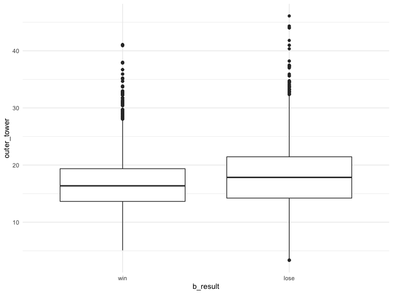

Tower
================
Xing Chen
12/1/2019

## read and clean the data

``` r
tower = read_csv(file = "./data/structures.csv") 
```

    ## Parsed with column specification:
    ## cols(
    ##   Address = col_character(),
    ##   Team = col_character(),
    ##   Time = col_double(),
    ##   Lane = col_character(),
    ##   Type = col_character()
    ## )

``` r
tower = 
  tower %>% 
  janitor::clean_names() %>% 
  filter(team == "bTowers", type == "OUTER_TURRET") %>% 
  mutate(
    address = str_remove(address, "http://matchhistory.na.leagueoflegends.com/en/#match-details/TRLH1/")
  )
```

calculate the mean time group by match id

``` r
tower = 
  tower %>% 
  group_by(address) %>% 
  mutate(
    outer_tower = mean(time, na.rm = TRUE)
  )
```

## Try some visualization

**Read the overall dataset**

``` r
overall = 
  read_csv(file = "./data/LeagueofLegends.csv") %>% 
  janitor::clean_names() %>% 
  mutate(address = str_remove(address, "http://matchhistory.na.leagueoflegends.com/en/#match-details/TRLH1/")) %>% 
  select(address, b_result)
```

    ## Parsed with column specification:
    ## cols(
    ##   .default = col_character(),
    ##   Year = col_double(),
    ##   bResult = col_double(),
    ##   rResult = col_double(),
    ##   gamelength = col_double()
    ## )

    ## See spec(...) for full column specifications.

``` r
merge_file = 
  left_join(overall, tower, by = "address") %>% 
  mutate(b_result = recode_factor(b_result, "1" = "win", "0" = "lose"))
```

``` r
merge_file %>% 
  ggplot(aes(x = b_result, y = outer_tower)) + 
  geom_boxplot()
```


